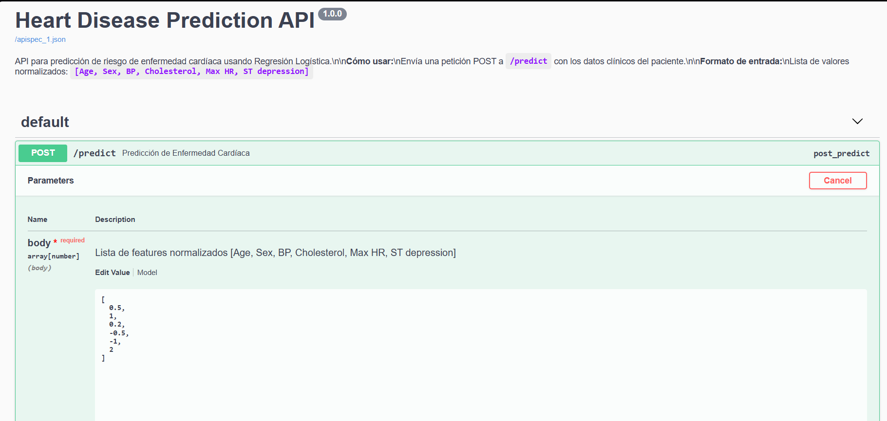
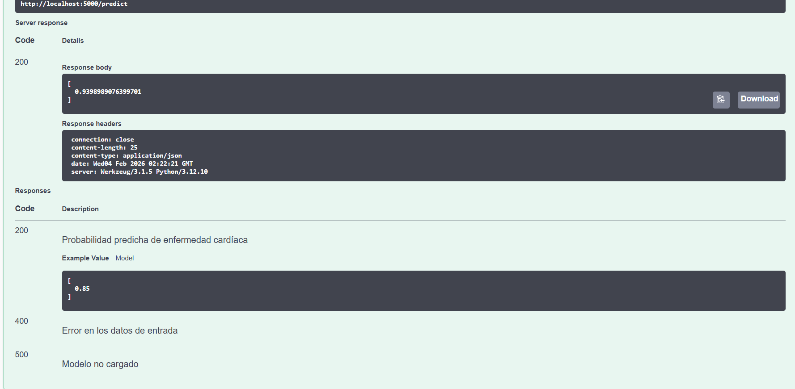

# Implementación de Regresión Logística desde Cero - Predicción de Enfermedad Cardíaca

Este proyecto implementa un algoritmo de **Regresión Logística** manualmente (sin usar la clase `LogisticRegression` de scikit-learn) para predecir la presencia de enfermedad cardíaca. El objetivo es educativo, demostrando el funcionamiento interno del entrenamiento mediante Gradient Descent, cálculo de funciones de costo y métricas de evaluación.

**Estudiante:** Juan Pablo Nieto Cortes  
**Asignatura:** AREP Arquitectura Empresarial

## Comenzando 🚀

Estas instrucciones te permitirán obtener una copia del proyecto y ejecutarlo en tu máquina local para propósitos de desarrollo y pruebas.

### Prerrequisitos 📋

Necesitas tener instalado Python 3 y Jupyter Notebook. Las librerías principales utilizadas son:

*   [NumPy](https://numpy.org/) - Para operaciones matriciales y matemáticas.
*   [Pandas](https://pandas.pydata.org/) - Para manipulación y análisis de datos.
*   [Matplotlib](https://matplotlib.org/) - Para visualización de datos.

```bash
pip install numpy pandas matplotlib jupyter
```

### Instalación 🔧

1.  Clona este repositorio o descarga los archivos en tu máquina local.
2.  Asegúrate de tener el dataset `Heart_Disease_Prediction.csv`. El notebook está configurado para buscarlo en una ruta específica o descargarlo automáticamente (si se usa el script adjunto).
3.  Abre el notebook en Jupyter:

```bash
jupyter notebook heart_disease_lr_analysis.ipynb
```

## Ejecutando las pruebas ⚙️

El notebook contiene celdas de ejecución paso a paso que actúan como verificación del modelo:

1.  **Carga de Datos**: Verifica que el dataset se carga correctamente y no tiene nulos.
2.  **Entrenamiento**: Ejecuta el descenso de gradiente y observa la curva de costo disminuyendo.
3.  **Evaluación**: Al final se imprimen métricas de precisión manuales.

### Analizando los resultados

Se calculan las siguientes métricas manualmente (sin `sklearn`):
*   Accuracy (Exactitud)
*   Precision
*   Recall
*   F1 Score

Ejemplo de salida esperada:

```text
Dataset   Accuracy  Precision  Recall    F1 Score
Train     0.85      0.88       0.82      0.85
Test      0.83      0.86       0.80      0.83
```

## Construido con 🛠️

*   [Jupyter Notebook](https://jupyter.org/) - Entorno interactivo de desarrollo.
*   [Python](https://www.python.org/) - Lenguaje de programación.
*   **Implementación propia** de algoritmos de Machine Learning (Sigmoide, Costo Log Loss, Gradient Descent, Ridge Regularization).

## Evidencia de Despliegue 📸

Esta sección demuestra que el modelo fue desplegado y probado exitosamente.





## Autores ✒️

*   **Juan Pablo Nieto Cortes** - *Trabajo Inicial & Documentación*

## Licencia 📄

Este proyecto es de uso académico y educativo.

## Expresiones de Gratitud 🎁

*   A la cátedra de **AREP Arquitectura Empresarial** por plantear este desafío.

*   Inspirado en los principios fundamentales del Machine Learning.
